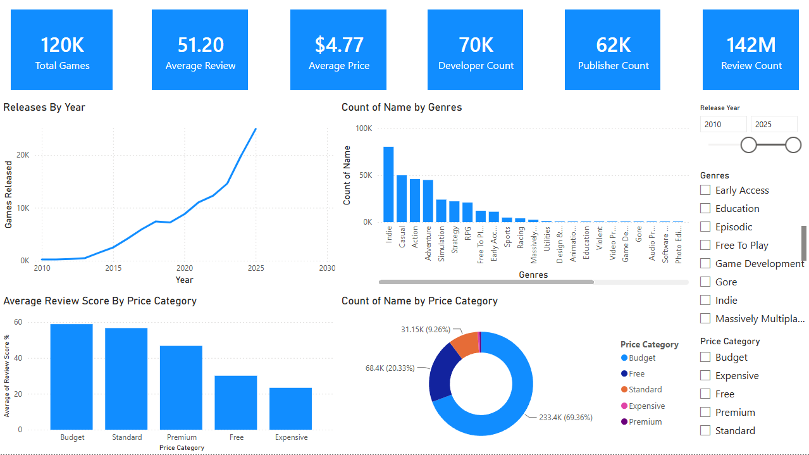

# Steam Games Market Analysis

An end-to-end data analytics project exploring over **126,000 Steam games** to uncover trends in pricing, player engagement, developer performance, marketplace growth, and business opportunities for indie game developers.

---

## Project Overview

This project demonstrates a complete analytics workflow from raw data to business recommendations.

The dataset was cleaned and analyzed using Python, stored inside a PostgreSQL database, and visualized through an interactive Power BI dashboard to provide executive-level insights.

---

## Tech Stack

- Python
- Pandas
- NumPy
- Matplotlib
- PostgreSQL
- SQL
- Power BI
- Git & GitHub
- Jupyter Notebook

---

# Project Workflow

```
Raw Steam Dataset (126K+ Games)
            │
            ▼
Data Cleaning & Feature Engineering (Python)
            │
            ▼
Exploratory Data Analysis
            │
            ▼
Business Insights Report
            │
            ▼
PostgreSQL Database
            │
            ▼
Power BI Executive Dashboard
```

---

# Business Questions Answered

### Genre Analysis

- Which game genres dominate the Steam marketplace?
- Which genres receive the highest average user ratings?
- Which genres generate the highest player engagement?
- Which genres appear to be oversaturated?

---

### Pricing Analysis

- Does a game's price influence its review score?
- What is the most common price range on Steam?
- Are free-to-play games generally rated better than paid games?

---

### Developer & Publisher Analysis

- Which developers have released the most games?
- Which publishers have the largest Steam presence?
- Which developers consistently release highly-rated games?

---

### Player Engagement Analysis

- Do games with more achievements receive better reviews?
- Does average playtime correlate with review scores?
- Which games have the highest estimated player ownership?
- Which games have the highest peak concurrent players?

---

### Release Trends

- Which years saw the largest number of game releases?
- Which months are the most popular for launching games?
- Has Steam become more competitive over time?

---

### Business Recommendations

- Which genres offer the best opportunities for new indie developers?
- What pricing strategy appears to maximize positive player reception?
- What characteristics are commonly found among successful Steam games?

---

# Power BI Dashboard

The project also includes an interactive Power BI dashboard connected to the PostgreSQL database.

### Executive Overview



The dashboard provides:

- Total games
- Average review score
- Average game price
- Developer count
- Publisher count
- Total review count
- Releases by year
- Genre distribution
- Price category distribution
- Interactive filters for:
  - Release Year
  - Genre
  - Price Category

---

# Key Insights

Some of the major findings include:

- Steam has experienced explosive marketplace growth since 2015.
- Indie, Casual, Action and Adventure are the most saturated genres.
- Price has almost no influence on review scores.
- Budget-priced games dominate the marketplace.
- Free-to-play and paid games receive similar player ratings.
- Games with longer player retention generally receive higher review scores.
- Multiplayer titles dominate ownership and concurrent player counts.
- Successful developers consistently prioritize quality over release quantity.

---

# Repository Structure

```
Steam Games Market Analysis
│
├── Data/
│   ├── Raw Dataset
│   └── Cleaned Dataset
│
├── Python/
│   ├── Data Cleaning
│   └── Exploratory Data Analysis
│
├── SQL/
│   └── PostgreSQL Queries
│
├── Dashboard/
│   ├── Steam_Marketplace_Analysis.pbix
│   └── Executive_Overview_PowerBI.png
│
├── Images/
│   ├── Genre Analysis
│   ├── Pricing Analysis
│   ├── Developer Analysis
│   ├── Player Engagement
│   └── Release Trends
│
├── Report/
│   └── Insights.md
│
└── README.md
```

---

# Detailed Report

A complete explanation of every visualization and business recommendation can be found here:

**Report/Insights.md**

The report contains:

- Graph explanations
- Key findings
- Business insights
- Final recommendations

---

# Project Highlights

✔ Cleaned and analyzed 126,000+ Steam games

✔ Answered 18+ real-world business questions

✔ Created 20+ visualizations using Python

✔ Designed an executive Power BI dashboard

✔ Stored cleaned data inside PostgreSQL

✔ Wrote SQL queries for analytical reporting

✔ Produced a detailed business insights report

---

# Conclusion

Steam has become one of the most competitive digital marketplaces in gaming, with over **120,000** titles available and thousands of new releases every year.

The analysis shows that **pricing alone has little effect on player satisfaction**, while **quality, player engagement, and long-term retention** are far stronger indicators of success.

This project demonstrates how Python, SQL, PostgreSQL, and Power BI can be combined into a complete data analytics workflow to transform raw data into actionable business insights.